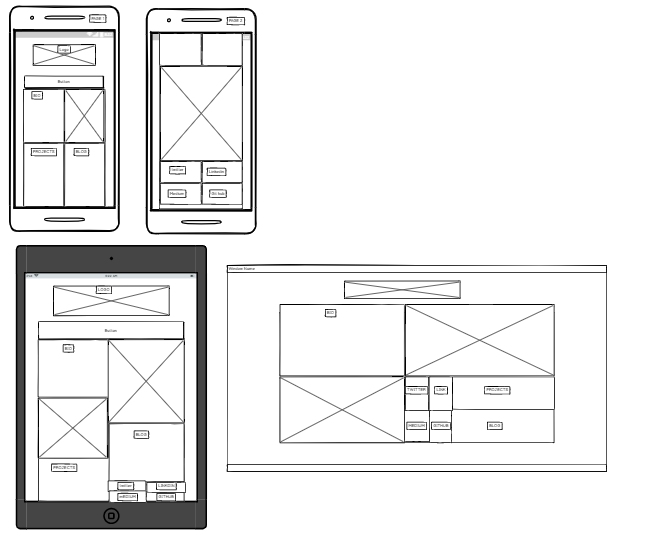
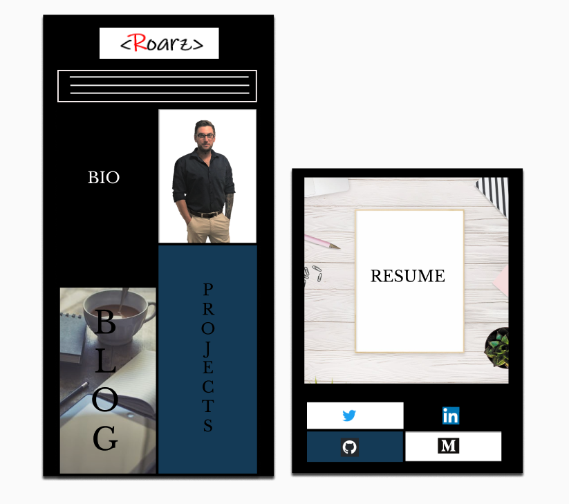
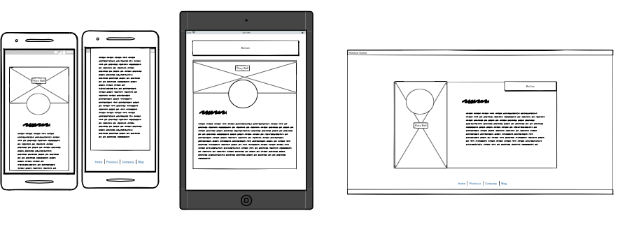
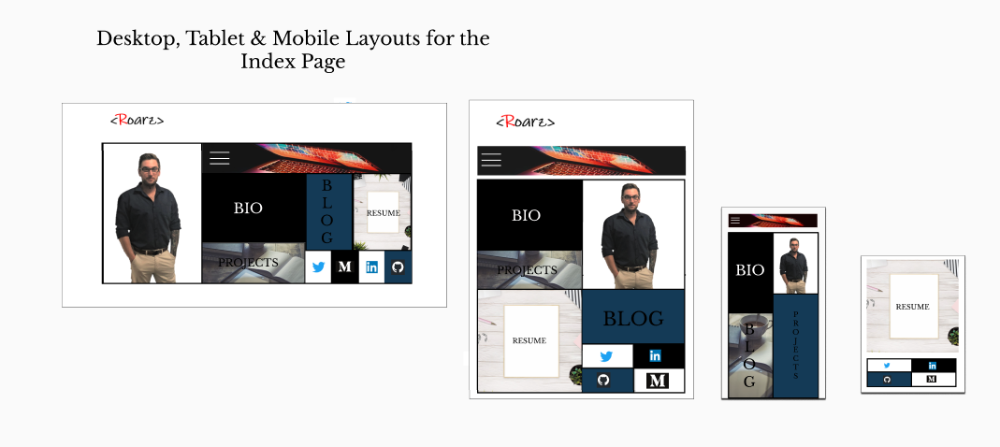
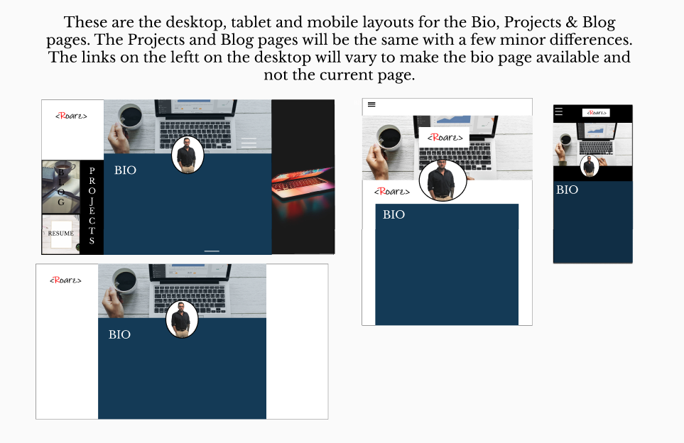
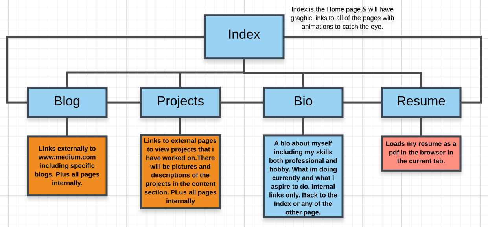

<h1>Welcome to my Portfolio Website</h1>

<h2>Build in progress</h2>

Im currently completing this project to display a  portfolio page which will contain my Blog, a platform for hosting my projects and work and professional and Personal Bio. This is an assessment task for my Fast Track Coding Bootcamp here at Coder Academy Brisbane.  

**17/09/2019**  

I have just completed the wireframes for the index page and the Mobile layout as you can see below. Its time to complete the layouts for the ipad and desktop versions and then on to some coding !! I am completing this project with the Mobile first methodology which is meant to improve responsiveness. Ill use some grid and flex box which i have seen in action and was impressed by the results. Both for ease of development and also for responsiveness. I have tried to make a very visual design with animation but still with accessability in mind. Ill keep you posted!!  

 

 

**17/09/2019**  

**Final wireframes and Mock-ups complete**  

**Wire Frames** 

 

**Mock ups** 

 

 

**Site Directory tree**  

 

