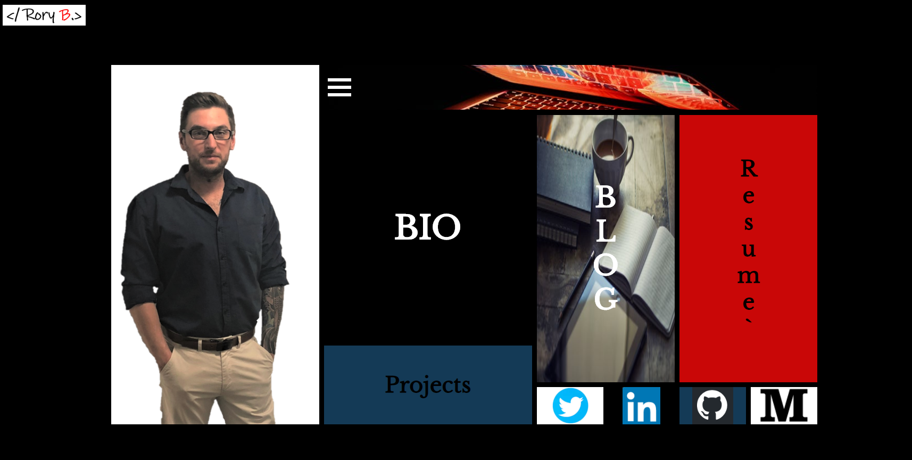
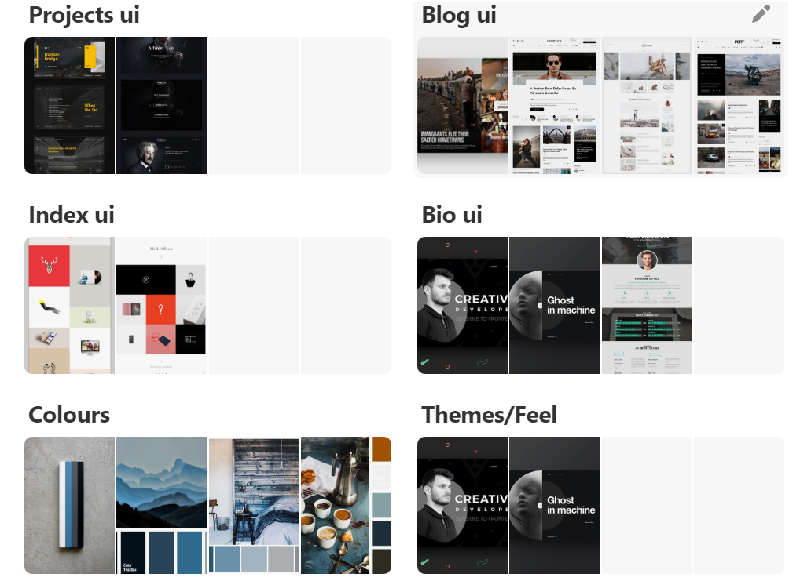

<h1>Welcome to my Portfolio Website</h1>

This Website is still hosted. Right here on GitHub pages. Alot of the info is out of date as this was hardcoded and the first website I ever really built. But i did upload a new resume to it!

 

<h2>Introduction</h2>

Hey! This is my portfolio website!! This website was created to form part of a Diploma of Information Technology, web development stream, which im completing at Coder Academy Brisbane. I have used HTML5, Css3 (with SCSS) & it has been hosted here at GitHub Pages. The address for the site is https://roakz.github.io/portfolio-website/   

I will use this website to upload projects that im undertaking and use it as a portfolio for my work. As my skills progress and I continue to learn further frameworks and languages I will endeavour to upgrade it to showcase my skills. It will become a digital resume & hopefully help me secure an Internship or paid Employment as a junior Web Developer.  

Below I have included a site map, some information about the planning, features & functionality and some information about some lessons learnt during development.  

<h3>Planning</h3>

There was a fair bit of planning that happened before completing this website. First of all I did some Mood Boarding to aquire some inspiration for the direction I wanted the website to take. Following on from this I used the project managment tool Trello to organise my tasks and create a workflow and then moved on to the Wireframing and Finally Mock-ups.   

The best thing about trello is its a live document that is always right there on your laptop ready to change and update in a neat organised environment.  

One of the things I learnt during this project is that taking the time to carry out some planning before diving right into code can definitely help make the coding phase alot easier as you know exactly what your aiming for.  

check out some snaps below! 

**Mood Boards** 

 

**Wire Frames** 

 

 

**Mock ups** 

 

 

<h3>Features/Funtionality</h3>

Features of the site include an interactive index page with animated icons for desktop that are clickable links. I originally had dropdown buttons on all layouts however discovered that making them work on IOS without some javascript or JQuery wasnt easily achieved and I had a strict dealine to meet. With this in mind I decided to remove the hamburger drop down from all tablet and mobile versions for now and replace them with a Top navigation bar. I have kept the code in the script so its easy to add after submission. On the desktop versions there is a Hover hambuger dropdown menu included.  I also included a slider coded purely in HTML and CSS on the projects page to upload images of future projects.

There are some fun animations throughout the site to keep the user engaged and improve user experience and interaction.  

This website was designed Mobile first Using grid and some flex box for layout and respponsivness and contains media queries to enable it to be responsive to mobile, tablet and desktop screen sizes.  

Although i had Accessability on my mind during the planning phase i feel that this is an area that needs dramatic improvment after submission and i look forward to improving this aspect of the page. 

**Site Directory tree** 

 

This site map Displays the general flow of the site. Essentially you can get to any page from any page and the resume link just loads a PDF Copy of my resume in the browser.  

**I Hope you enjoy the site !!!**  

**Feedback is always welcome!!!!**  

<h3>What did I lean?</h3>

I Learnt alot from this project!!! I learnt lots of small lessons about HTML and CSS that add up to one big learning curve. I also learnt the importance of contributing to the tech community to ensure that other people recieve the same help when they are stuck that you might need when your stuck. It also helped improve on my existing project managment and time managment skills aswell as Web Development skills in general. Everything from planning to production and hosting the site live.  

**All in all a great success! and I look forward to improving on it in and adding to it in the future!**
